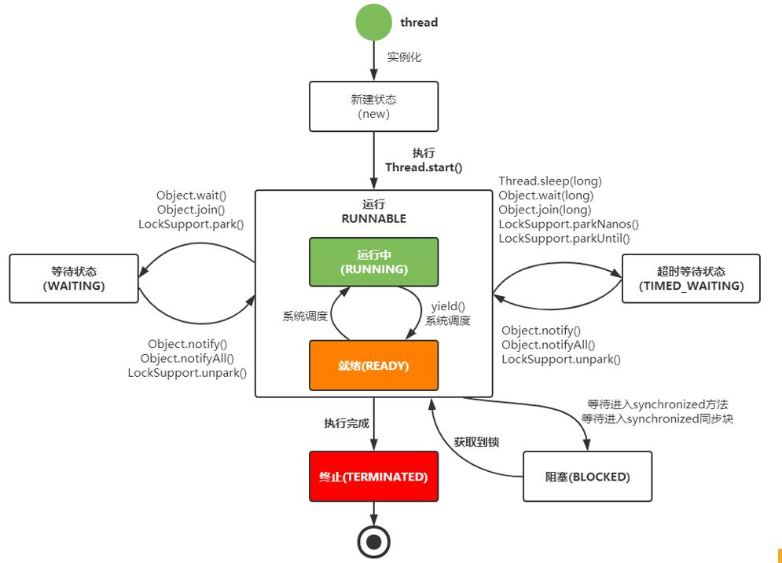
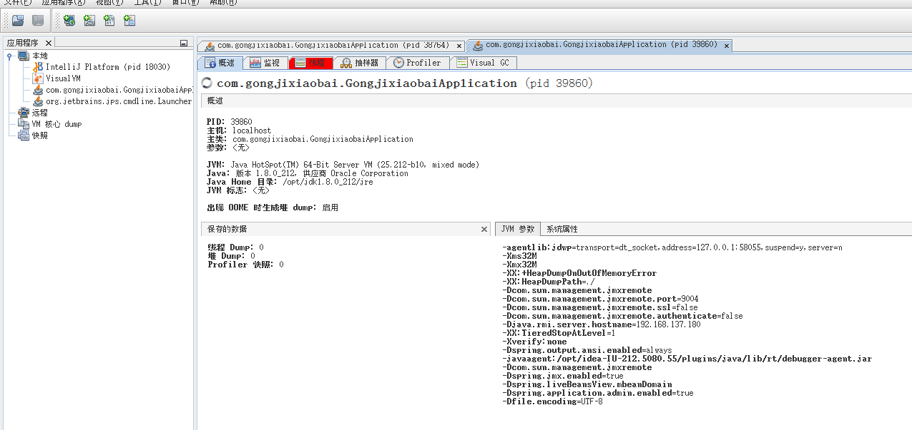

##JVM调优
###1.JVM的参数类型
```
  标准参数
  -help
  -server -client
  -verson -showversion
  -cp -classpath
  X参数
  -Xint:解释执行
  -Xcomp:第一次使用就编译成本地代码
  -Xmixed:混合模式，JVM自己来决定是否编译成本地代码   
  --XX参数
  Boolean类型
  格式:[+-]<name>表示启用或者禁用name属性
  例子:-XX:+UseConcMarkSweepGC
  -XX:+UseG1GC
  非Boolean类型
  格式:<name>=<value>表示name属性的值是value
  例子:-XX:MaxGCPauseMills=500
  -XX:GCTimeRation=19
  -Xmx -Xms 不是X参数,而是XX参数 最大内存与最小内存
  -Xmx等价于-XX:MaxHeapSize
  -Xms等价于-XX:InitalHeapSize
  -xss等价于-XX:ThreadStackSize 栈内存 默认1024k
```

###2.查看JVM运行时参数
```
  -XX:+PrintFlagsInitial查看初始值
  -XX:+PrintFlagsFinal查看最终值
  -XX:+UnlockExperimentalVMOptions解锁实验参数  
``` 

###3.导出内存镜像文件
####内存溢出自动导出
```
  -XX:+HeapDumpOnOutOfMemoryError
  -XX:HeapDumpPath=./
```
####使用jmap命令手动导出
```
  jmap -dump:format=b,file=heap.hprof pid
```

###4.死循环与死锁
####线程生命周期

####jstack
```
  查看占用cpu高的进程
  top
  保存当前进程栈信息
  jstack pid > pid.txt
  查看进程信息
  top -p pid -H
  十进制转十六进制
  printf "%x" threadid
```
####java VisualVM
* 本地连接
  
* 远程连接
```
  -Dcom.sun.management.jmxremote
  -Dcom.sun.management.jmxremote.port=9004
  -Dcom.sun.management.jmxremote.ssl=false
  -Dcom.sun.management.jmxremote.authenticate=false
  -Djava.rmi.server.hostname=192.168.137.180
```

